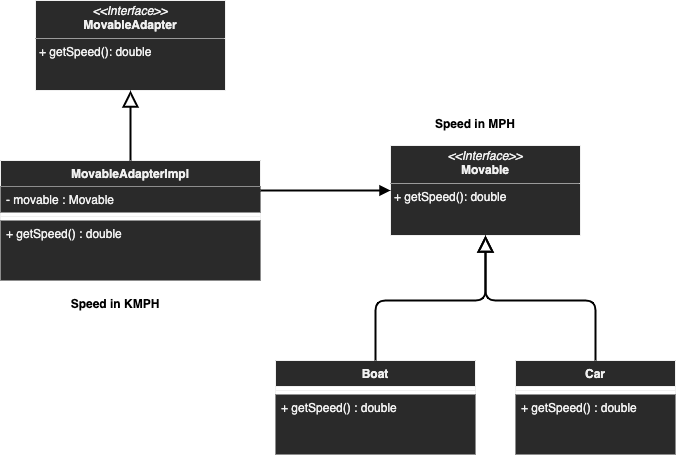

# Singleton

## Description
Allowing objects with incompatible interfaces to collaborate

## Diagram
<p align="center">
  
</p>

## Code
Check code [here](../src/main/java/com/devt/patterns/adapter)

```java
public interface Movable {
    double getSpeed();// speed in MPH
}
public class Car implements Movable {
    private double speed;
    public Car(double speed) {
        this.speed = speed;
    }
    @Override
    public double getSpeed() {
        return speed;
    }
}
public interface MovableAdapter {
    double getSpeed(); // speed in KM/H
}
public class MovableAdapterImpl implements MovableAdapter {
    private Movable movable;
    public MovableAdapterImpl(Movable movable) {
        this.movable = movable;
    }
    @Override
    public double getSpeed() {
        return movable.getSpeed() * 1.60934;
    }
}
```

To access the instance
```java
Movable bugatti = new Car(268);
final double speedInMPH = bugatti.getSpeed();
MovableAdapter bugattiVAdapter = new MovableAdapterImpl(bugatti);
final double speedInKMH = bugattiVAdapter.getSpeed();
```

## Use cases
- whenever you want to use an existing class, but it's interface isn't compatible with the rest of the code
