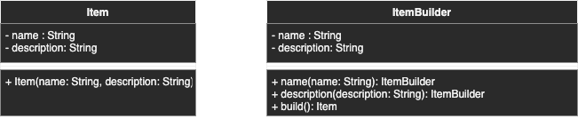

# Builder

## Description
Provide a way to create a complex object with different representation in a simplified manner

This design pattern helps to get rid of the "telescopic constructor"

## Diagram
<p align="center">
  
</p>

## Code
Check code [here](../src/main/java/com/devt/patterns/builder)

```java
public class Item {

    private String name;
    private String description;

    public Item(String name, String description) {
        this.name = name;
        this.description = description;
    }
}

public class ItemBuilder {

    private String name;
    private String description;

    public ItemBuilder name(String name) {
        this.name = name;
        return this;
    }

    public ItemBuilder description(String description) {
        this.description = description;
        return this;
    }

    public Item build() {
        return new Item(name, description);
    }

}

```

To access the instance
```java
Item item = new ItemBuilder()
        .name("item name")
        .description("item description")
        .build();
```

### A simplified version with lombok
You can apply the builder design pattern by simply adding the lombok `@Builder` annotation on the class
```java
@Builder
public class Item {
    private String name;
    private String description;
}
```

To access the instance
```java
Item item = Item.builder()
        .name("item name")
        .description("item description")
        .build();
```

## Use cases
- `StringBuilder` with the method `append(String str)` to concatenate strings
