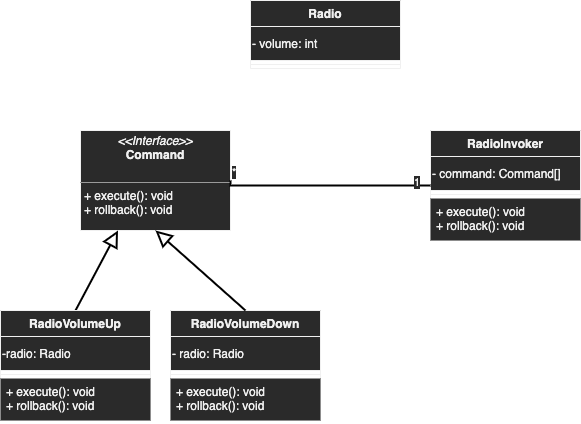

# Command

## Description
An action is wrapped under an object as command and passed to invoker object.

## Diagram
<p align="center">
  
</p>

## Code
Check code [here](../src/main/java/com/devt/patterns/command)

```java
public interface Command {
    void execute();
    void rollback();
}
public class Radio {
    @Getter
    @Setter
    private int volume;
    public Radio() {
        this.volume = 0;
    }
}
public class RadioVolumeDown implements Command {
    private Radio radio;
    public RadioVolumeDown(Radio radio) {
        this.radio = radio;
    }
    @Override
    public void execute() {
        this.radio.setVolume(this.radio.getVolume() - 1);
    }
    @Override
    public void rollback() {
        this.radio.setVolume(this.radio.getVolume() + 1);
    }
}
public class RadioVolumeUp implements Command {
    private Radio radio;
    public RadioVolumeUp(Radio radio) {
        this.radio = radio;
    }
    @Override
    public void execute() {
        this.radio.setVolume(this.radio.getVolume() + 1);
    }
    @Override
    public void rollback() {
        this.radio.setVolume(this.radio.getVolume() - 1);
    }
}
public class RadioInvoker implements Command {
    private List<Command> commands;
    public RadioInvoker(List<Command> commands) {
        this.commands = commands;
    }
    @Override
    public void execute() {
        commands.forEach(Command::execute);
    }
    @Override
    public void rollback() {
        commands.forEach(Command::rollback);
    }
}
```

To access the instance
```java
Radio radio = new Radio();
RadioInvoker remonteControl = new RadioInvoker(Arrays.asList(
        new RadioVolumeUp(radio),
        new RadioVolumeUp(radio),
        new RadioVolumeUp(radio),
        new RadioVolumeUp(radio),
        new RadioVolumeUp(radio),
        new RadioVolumeDown(radio),
        new RadioVolumeUp(radio)
));
remonteControl.execute();
```
