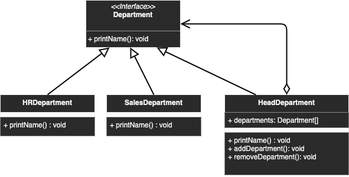

# Composite

## Description
Allowing to treat an individual object and compositions of the same object the same way

## Diagram
<p align="center">
  
</p>

## Code
Check code [here](../src/main/java/com/devt/patterns/composite)

```java
// Component
public interface Department { 
    void printName();
}
// Leaf components
public class HRDepartment implements Department {
    private String name;
    public HRDepartment(String name) {
        this.name = name;
    }
    @Override
    public void printName() {
        System.out.println(name);
    }
}
public class SalesDepartment implements Department {
    private String name;
    public SalesDepartment(String name) {
        this.name = name;
    }
    @Override
    public void printName() {
        System.out.println(name);
    }
}
// Composite
public class HeadDepartment implements Department {
    private String name;
    private List<Department> departments;
    public HeadDepartment(String name) {
        this.name = name;
        departments = new ArrayList<>();
    }
    @Override
    public void printName() {
        departments.forEach(Department::printName);;
    }
    public void addDepartment(Department department) {
        departments.add(department);
    }
    public void removeDepartment(Department department) {
        departments.remove(department);
    }
}
```

To access the instance
```java
HeadDepartment headDepartment = new HeadDepartment("HeadDepartment");
headDepartment.addDepartment(new HRDepartment("HRDepartment"));
headDepartment.addDepartment(new SalesDepartment("SalesDepartment"));
headDepartment.printName();
```

## Use cases
- Folder (is a folder itself, and can contains folders)
- Hierarchies
- ...
