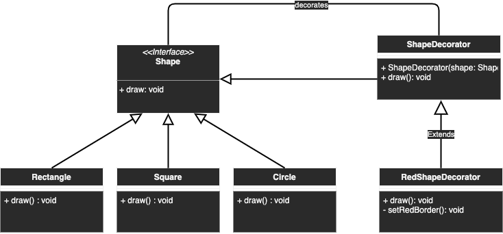

# Decorator

## Description
Adding new functionality to an existing object without altering its structure

## Diagram
<p align="center">
  
</p>

## Code
Check code [here](../src/main/java/com/devt/patterns/decorator)

```java
public interface Shape {
    void draw();
}
public class Rectangle implements Shape {
    @Override
    public void draw() {
        System.out.println("Rectangle");
    }
}
public class Square implements Shape {
    @Override
    public void draw() {
        System.out.println("Square");
    }
}
public class Circle implements Shape {
    @Override
    public void draw() {
        System.out.println("Circle");
    }
}
public abstract class ShapeDecorator implements Shape {
    protected Shape shape;
    public ShapeDecorator(Shape shape) {
        this.shape = shape;
    }
    public void draw() {
        shape.draw();
    }
}
public class RedShapeDecorator extends ShapeDecorator {
    public RedShapeDecorator(Shape shape) {
        super(shape);
    }
    @Override
    public void draw() {
        shape.draw();
        setRedBorder();
    }
    private void setRedBorder() {
        System.out.println("Border Color: Red");
    }
}
```

To access the instance
```java
Shape circle = new Circle();
Shape redCircle = new RedShapeDecorator(new Circle());
Shape redRectangle = new RedShapeDecorator(new Rectangle());
circle.draw();
redCircle.draw();
redRectangle.draw();
```
