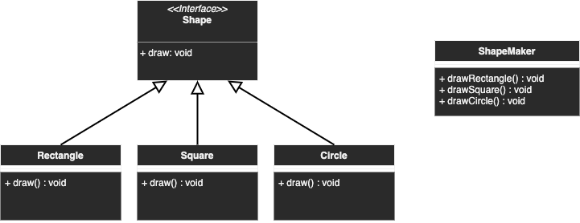

# Facade

## Description
Simplifying an already complex subsystem by creating a new wrapper class called Facade.

## Diagram
<p align="center">
  
</p>

## Code
Check code [here](../src/main/java/com/devt/patterns/facade)

```java
public interface Shape {
    void draw();
}
public class Rectangle implements Shape {
    @Override
    public void draw() {
        System.out.println("Rectangle");
    }
}
public class Square implements Shape {
    @Override
    public void draw() {
        System.out.println("Square");
    }
}
public class Circle implements Shape {
    @Override
    public void draw() {
        System.out.println("Circle");
    }
}
// Wrapper class
public class ShapeMaker() {
    private Shape rectangle;
    private Shape square;
    private Shape circle;
    public ShapeMaker() {
        rectangle = new Rectangle();
        square = new Square();
        circle = new Circle();
    }
    public void drawRectangle() {
        rectangle.draw();
    }
    public void drawSquare() {
        square.draw();
    }
    public void drawCircle() {
        circle.draw();
    }
}
```

To access the instance
```java
ShapeMaker shapeMaker = new ShapeMaker();
shapeMaker.drawRectangle();
shapeMaker.drawSquare();
shapeMaker.drawCircle();
```

## Use cases
- Simplifying or hiding a complex system with a wrapper class
