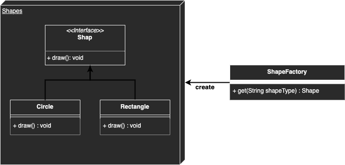

# Singleton

## Description
Creating a specific class without the need to call the exact class.
A factory class will take care of creating and initializing the class.

## Diagram
<p align="center">
  
</p>

## Code
Check code [here](../src/main/java/com/devt/patterns/factory)

```java
public interface Shape {
    void draw();
}

public class Rectangle implements Shape {
    @Override
    public void draw() {
        System.out.println("Drawing a rectangle");
    }
}

public class Circle implements Shape {
    @Override
    public void draw() {
        System.out.println("Drawing a circle");
    }
}

public class ShapeFactory {

    public Shape get(String type) {
        switch (type) {
            case "CIRCLE":
                return new Circle();
            case "RECTANGLE":
                return new Rectangle();
            default:
                throw new UnsupportedOperationException();
        }
    }

}
```

To access the instances
```java
ShapeFactory factory = new ShapeFactory();
Shape circle = factory.get("CIRCLE");
circle.draw();
Shape rectangle = factory.get("RECTANGLE");
rectangle.draw();
```

