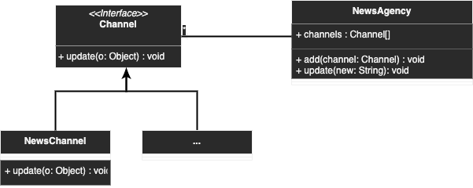

# Observer

## Description

## Diagram
<p align="center">
  
</p>

## Code
Check code [here](../src/main/java/com/devt/patterns/observer)

```java
```

To access the instance
```java
```

## Use cases
