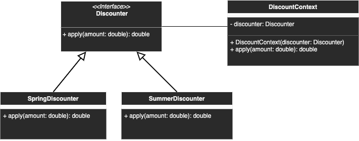

# Strategy

## Description
Allowing to change the algorithm/strategy at runtime.

## Diagram
<p align="center">
  
</p>

## Code
Check code [here](../src/main/java/com/devt/patterns/strategy)

```java
public interface Discounter {
    double apply(double amount);
}
public class SpringDiscounter implements Discounter {
    @Override
    public double apply(double amount) {
        return amount * 0.9;
    }
}
public class SummerDiscounter implements Discounter {
    @Override
    public double apply(double amount) {
        return amount * 0.8;
    }
}
public class DiscountContext {
    private Discounter discounter;
    public DiscountContext(Discounter discounter) {
        this.discounter = discounter;
    }
    public double apply(double amount) {
        return discounter.apply(amount);
    }
}
```

To access the instance
```java
final DiscountContext context = new DiscountContext(new SpringDiscounter());
final double amountAfterDiscount = context.apply(100);
```
